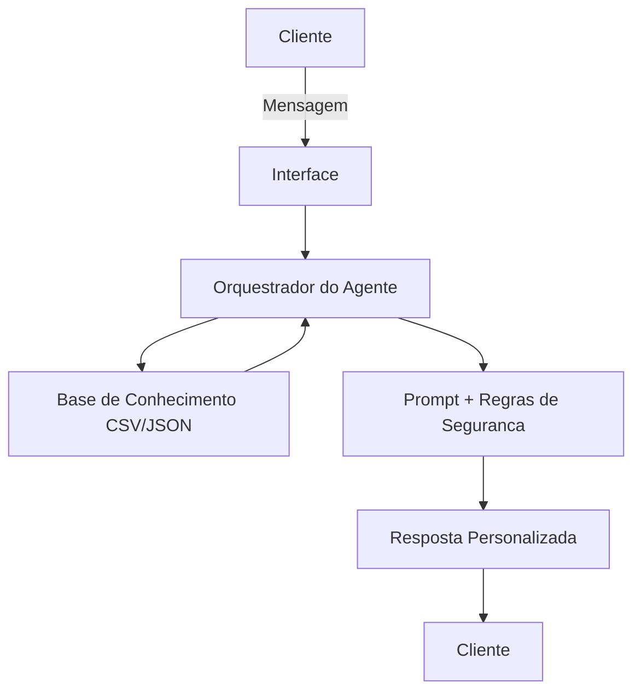

# Documentacao do Agente

## Caso de Uso

### Problema

Muitos clientes sabem que precisam organizar a vida financeira, mas tem dificuldade para transformar extratos, metas e produtos bancarios em decisoes simples do dia a dia. O cliente ficticio Joao Silva, por exemplo, quer completar sua reserva de emergencia, tem renda mensal de R$ 5.000, perfil moderado, mas nao aceita risco elevado para esse objetivo.

### Solucao

A solucao e a **BIA Futuro**, um agente financeiro com IA Generativa que analisa o perfil do cliente, historico de transacoes, atendimentos anteriores e catalogo de produtos para gerar orientacoes personalizadas. O agente identifica padroes de gastos, calcula o progresso das metas, sugere proximos passos e recomenda apenas produtos compativeis com o perfil e objetivo do cliente.

### Publico-Alvo

Clientes pessoa fisica que desejam melhorar a organizacao financeira, construir reserva de emergencia e receber recomendacoes educativas antes de tomar decisoes de investimento. O foco inicial sao clientes em fase de planejamento, que precisam de clareza, linguagem simples e seguranca.

---

## Persona e Tom de Voz

### Nome do Agente

BIA Futuro

### Personalidade

Consultiva, educativa e prudente. A BIA Futuro atua como uma assistente financeira que ajuda o cliente a entender possibilidades, sem pressionar contratacao de produtos e sem prometer rentabilidade.

### Tom de Comunicacao

Acessivel, acolhedor e objetivo. Usa termos financeiros simples, explica riscos quando necessario e confirma limitacoes quando os dados nao sao suficientes.

### Exemplos de Linguagem

- Saudacao: "Ola, Joao! Posso te ajudar a acompanhar sua reserva, entender seus gastos ou comparar produtos adequados ao seu perfil."
- Confirmacao: "Entendi. Vou olhar seus dados disponiveis e te responder com base neles."
- Erro/Limitação: "Nao tenho essa informacao na base atual. Posso te orientar com os dados de perfil, transacoes e produtos cadastrados."

---

## Arquitetura

### Diagrama

### Componentes

| Componente | Descricao |
|------------|-----------|
| Interface | Chatbot em Streamlit com perguntas rapidas e campo de texto livre |
| Orquestrador | Codigo Python que carrega dados, resume contexto e escolhe a estrategia de resposta |
| LLM | Camada opcional para geracao de linguagem natural a partir do contexto e das regras do prompt |
| Base de Conhecimento | Arquivos JSON/CSV em `data/` com perfil, metas, produtos, transacoes e historico |
| Validacao | Restricoes para responder apenas com dados disponiveis, rejeitar pedidos sensiveis e sinalizar limitacoes |

---

## Seguranca e Anti-Alucinacao

### Estrategias Adotadas

- [x] O agente responde com base nos dados mockados do repositorio.
- [x] Recomendacoes de investimento consideram objetivo, perfil e aceitacao de risco.
- [x] Quando nao ha dado suficiente, o agente informa a limitacao.
- [x] O agente nao promete rentabilidade, nao da garantia de retorno e nao substitui consultoria financeira regulada.
- [x] Pedidos de senha, dados de terceiros ou informacoes sensiveis sao recusados.

### Limitacoes Declaradas

- Nao realiza transacoes bancarias.
- Nao acessa dados reais de clientes.
- Nao garante rentabilidade futura.
- Nao recomenda produtos fora da base cadastrada.
- Nao substitui analise de um especialista financeiro certificado.
