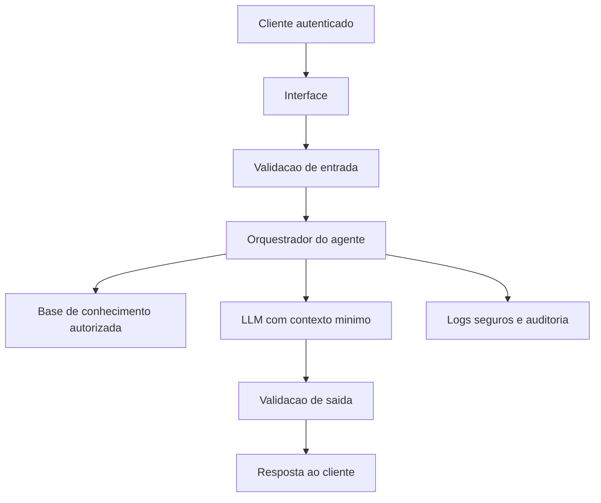

# Ciberseguranca e Protecao do Agente

## Objetivo

Definir os primeiros controles de seguranca para proteger os dados usados pela BIA Futuro, reduzir riscos de vazamento e aumentar a confiabilidade do agente em um contexto financeiro.

## Dados e Privacidade

Neste prototipo, os dados sao mockados e ficam armazenados localmente na pasta `data/`. Em uma evolucao para ambiente real, a solucao deve seguir principios de minimizacao, consentimento e finalidade:

- Usar apenas dados necessarios para responder ao objetivo financeiro do cliente.
- Evitar envio de CPF, senhas, tokens, chaves, dados bancarios completos ou identificadores sensiveis ao modelo.
- Mascarar dados pessoais antes de registrar logs ou enviar contexto para uma LLM.
- Separar dados de demonstracao, homologacao e producao.
- Definir retencao: logs de conversas devem ter prazo de guarda e descarte seguro.

## Ameacas Principais

| Risco | Exemplo | Controle Inicial |
|-------|---------|------------------|
| Vazamento de dados | Prompt ou log com informacao sensivel | Mascaramento, logs minimos e revisao de campos enviados |
| Prompt injection | Usuario tenta fazer o agente ignorar regras | System prompt com regras fixas e validacao antes/depois da resposta |
| Alucinacao financeira | Agente inventa produto, taxa ou recomendacao | Responder apenas com base na base de conhecimento |
| Acesso indevido | Usuario tenta consultar dados de outro cliente | Controle de identidade, autorizacao e isolamento por cliente |
| Manipulacao da base | Alteracao indevida em JSON/CSV ou base vetorial | Controle de versao, permissoes e trilha de auditoria |
| Exposicao de segredos | API key no codigo ou repositorio | Uso de variaveis de ambiente e `.env` fora do Git |

## Guardrails do Agente

A BIA Futuro deve operar com as seguintes regras:

1. Nao solicitar nem armazenar senhas, tokens ou codigos de autenticacao.
2. Nao revelar dados de terceiros.
3. Nao inventar produtos, rentabilidades, taxas ou politicas.
4. Nao executar operacoes financeiras reais.
5. Sinalizar quando a informacao nao existe na base.
6. Classificar perguntas sensiveis antes de responder.
7. Registrar eventos de seguranca sem guardar conteudo sensivel integral.

## Arquitetura Segura Recomendada

## Controles para Proxima Versao

- Autenticacao de usuario antes do chat.
- Autorizacao por cliente para impedir acesso cruzado.
- Variaveis de ambiente para segredos de API.
- Camada de moderacao para detectar conteudo sensivel.
- Mascaramento de dados em logs.
- Testes de prompt injection.
- Revisao de dependencias com ferramenta de seguranca.
- Monitoramento de erros, latencia e respostas bloqueadas.

## Checklist de Demonstracao Segura

- [x] Usar somente dados ficticios.
- [x] Nao incluir chaves de API no codigo.
- [x] Explicar que o agente nao realiza transacoes reais.
- [x] Mostrar recusa para pedido de senha ou dados de terceiros.
- [x] Mostrar resposta limitada a base de conhecimento.
- [ ] Adicionar autenticacao quando sair do ambiente local.
- [ ] Adicionar logs seguros sem dados sensiveis.

## Proximos Passos com Time de Ciberseguranca

1. Mapear dados tratados pelo agente e classificar sensibilidade.
2. Definir quais dados podem entrar no prompt da LLM.
3. Criar politica de logs e retencao.
4. Testar ataques de prompt injection e vazamento de contexto.
5. Revisar dependencias, ambiente de execucao e permissoes.
6. Definir aprovacao para uso de LLM externa ou modelo local.
7. Criar plano de resposta a incidentes para comportamento indevido do agente.
